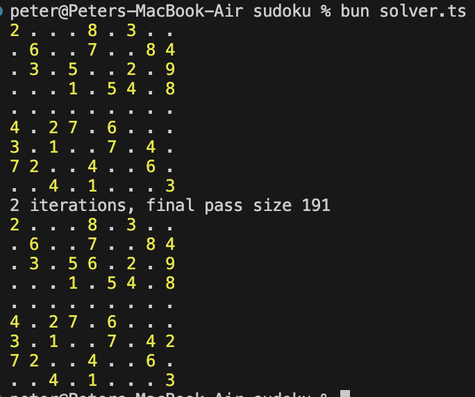
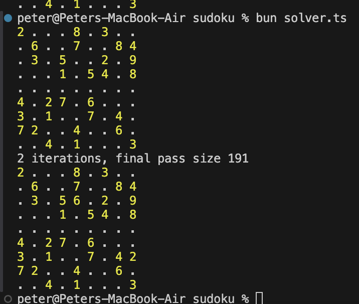

# January Puzzle

# Sun 12/1/24

## Provisional Solution

- naive approach:
- code a Sudoku solver
- iterate through the 9 possible number sets to obtain all possible solutions
- for each solution, calculate the highest common factor of the rows

## Starting with HCF Function

- HCF is the intersection of common prime factors
- faint memory of a clever trick using a while loop to continually divide the target integer until no longer possible
- makes sense, because if 2 is a prime factor, we can divide the number by 2 N times until it is no longer divisible by 2
- this also means that it cannot be divisible by 4, 8, 16 etc.
- next we try to divide by 3,
- then 4 (which we know won't work)
- then 5 (which might - 5 is prime)
- etc.
- may not be perfectly efficient, but probably works for numbers < 1 billion

## Let's solve sudoku first...

Pull some samples from: https://github.com/dimitri/sudoku/blob/master/sudoku.txt

The methods I use for solving:

- iterate through 1-9 and visualise lines (1x9) or (9x1)
  - any lines that intersect all the cells in a square except one are solved numbers
  - any lines that intersect cells in a square to leave remaining cells that align can be used to project further lines into other squares
    (i.e. if a number must be within aligned cells within a 3x3 square, it can be deduced that that number can not be placed anywhere else on the corresponding 1x9 line)
    The above usually yields good progress, and the approach can be repeated every time new digits are filled
    When it stops working, I iterate through the 3x3 squares looking for any that are close to full. Considering the digits remaining, do the rows and columns intersecting that square rule out all number placement options except one?

Thinking like a computer:

- create a shadow grid of possible numbers for each cell
- any cells that are certain will contain one number

The simple methods:

- for each cell, remove possibilities based on: row, column, square

The harder methods:

- if a 9 cell set (row, column or square) contains 2 cells with only 2 possible numbers, eliminate those 2 numbers from all other cells in the set
- expand the above rule to N cells (i.e. 3 numbers must go in 3 cells etc. - this is rare)

16/1/24 Progress update
Simple method alone solves several puzzles - [0, 4, 7, 11, 15, 16, 18, 19, 33, 35, 37, 39]

Adding the pair elimination, big improvement - [0, 3, 4, 7, 10, 11, 14, 15, 16, 17, 18, 19, 20, 22, 24, 26, 27, 33, 34, 35, 36, 37, 38, 39]

More debugging
Input #02

Next thing to try, row & line eliminations.

If the only possible placements of a digit within a 3x3 box line up on either a row or a column, that digit cannot occur anywhere else in the remainder of that row/column.

How to code this?

Before that! I forgot the very simple step of checking whether a number only appeared once in a row / col / box. If it does, it can be filled in!

e.g. fill in a '4' in cell 0,1 here: 
